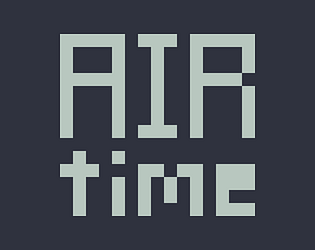

<!-- title: AIR time --> 

| 날짜 | 2023-04-07 |
| --- | --- |
| 제출 | [https://itch.io/jam/lame-jam-27/rate/2009415](https://itch.io/jam/lame-jam-27/rate/2009415) |
| 라이브러리 | pygame |

# 개요

최초로 미니잼이 아닌 게임잼(lame jam)에 참여한 게임이다.

테마는 **Playing with time**이었고, 공중에 있으면 시간이 멈추는 기믹을 만들었다.

# 결과

| **Criteria** | **Rank** | **Score*** | **Raw Score** |
| --- | --- | --- | --- |
| [Theme](https://itch.io/jam/lame-jam-27/results) | #2 | 4.067 | 4.067 |
| [Fun](https://itch.io/jam/lame-jam-27/results/fun) | #3 | 4.067 | 4.067 |
| [Creativity](https://itch.io/jam/lame-jam-27/results/creativity) | #6 | 3.667 | 3.667 |