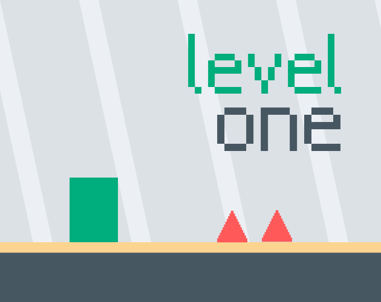

<!-- title: level_one -->
<!-- tags: #gamejam -->

|  |  |
| --- | --- |
| 날짜 | 2024-12-20 |
| 제출 | [https://itch.io/jam/mini-jam-174-defense/rate/3197426](https://itch.io/jam/mini-jam-174-defense/rate/3197426) |
| 라이브러리 | love2d |

# 개요

[깃허브](https://github.com/minufy/minijam174)

처음으로 love2d 프레임워크를 사용한 게임이다.

테마는 **Defense**, 리미테이션은 **Only one resource**였다.

테마는 사용하지 않았고, 리미테이션은 하나의 레벨(resource)에서 변화를 주는 방식으로 사용했다.

# 결과

| **Criteria** | **Rank** | **Score*** | **Raw Score** |
| --- | --- | --- | --- |
| [Enjoyment](https://itch.io/jam/mini-jam-174-defense/results/enjoyment) | #5 | 3.867 | 3.867 |
| Overall | #13 | 3.658 | 3.658 |
| [Presentation](https://itch.io/jam/mini-jam-174-defense/results/presentation) | #17 | 3.867 | 3.867 |
| [Use of the Limitation](https://itch.io/jam/mini-jam-174-defense/results/use-of-the-limitation) | #28 | 3.433 | 3.433 |
| [Concept](https://itch.io/jam/mini-jam-174-defense/results/concept) | #34 | 3.467 | 3.467 |