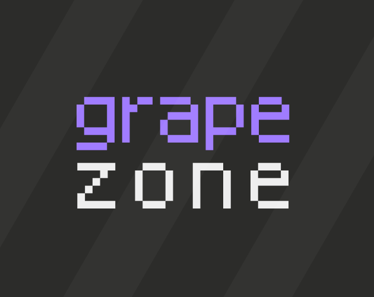
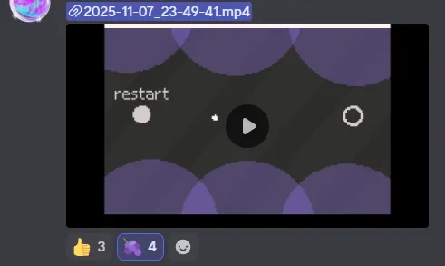

<!-- title: grape zone -->

|  |  |
| --- | --- |
| 날짜 | 2025-11-07 |
| 제출 | [https://itch.io/jam/mini-jam-197-recursion/rate/4022229](https://itch.io/jam/mini-jam-197-recursion/rate/4022229) |
| 라이브러리 | love2d |

# 개요

[깃허브](https://github.com/minufy/minijam197)

테마는 **재귀**, 리미테이션은 **Mouse only**였다.

테마는 선택사항이기 때문에 사용하지 않았고, 리미테이션은 감옥탈출같은 마우스만을 이용한 게임플레이를 통해 사용했다.

# 개발

지난 게임잼 [level_one](/blog/level_one)이후로 love2d 프레임워크를 익히면서 다양한 프로젝트 템플릿을 제작 및 사용해왔는데, 이번에는 [giban](https://github.com/minufy/giban)이라는 템플릿을 사용해 개발을 진행했다.

리미테이션을 보고 생각난 감옥탈출같은 마우스 피하기 게임을 제작했다.

다각형으로 장애물을 만들면 충돌 감지에서 외부 라이브러리를 사용하는 것이 귀찮기 때문에 그냥 모든 장애물을 원으로 제작했다. 

플레이 테스트 중, 빠른 속도로 마우스를 움직이면 대부분 장애물이 뚫리는 이슈가 있었는데, 마우스 이동속도를 제한하는 것으로 해결했다.

만든걸 녹화해서 올렸더니 🍇 반응이 달리길래 게임명도 grape zone으로 작명했다.

제작하는데 이틀에 걸쳐 약 2시간이 걸렸다. 유니티같은 게임 엔진보다 love2d같은 간단한 프레임워크를 쓰는게 빠른 개발에 더 적합한 것 같다.

# 결과

| **Criteria** | **Rank** | **Score*** | **Raw Score** |
| --- | --- | --- | --- |
| Overall | #1 | 4.421 | 4.421 |
| [Use of the Limitation](https://itch.io/jam/mini-jam-197-recursion/results/use-of-the-limitation) | #1 | 4.895 | 4.895 |
| [Enjoyment](https://itch.io/jam/mini-jam-197-recursion/results/enjoyment) | #2 | 4.421 | 4.421 |
| [Concept](https://itch.io/jam/mini-jam-197-recursion/results/concept) | #6 | 4.105 | 4.105 |
| [Presentation](https://itch.io/jam/mini-jam-197-recursion/results/presentation) | #7 | 4.263 | 4.263 |

1등ㅋㅋㅋㅋㅋㅋㅋㅋㅋㅋㅋ