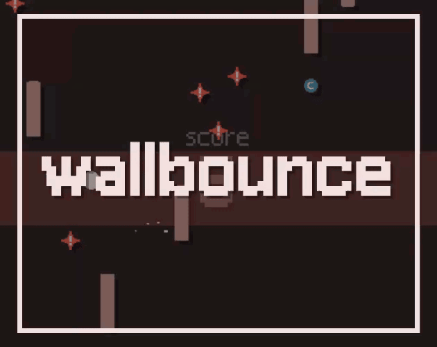

<!-- title: wallbounce -->

| 날짜 | 2026-03-18 |
| --- | --- |
| 제출 | [https://itch.io/jam/love2d-jam-2026/rate/4401382](https://itch.io/jam/love2d-jam-2026/rate/4401382) |
| 라이브러리 | love2d |

# 개요
[깃허브](https://github.com/minufy/lovejam2026)

최초로 참여해본 love2d jam이다.

테마는 **Counter**였고, 사용하지 않았다.

# 개발
[giban](https://github.com/minufy/giban)을 수정한 [reban](https://github.com/minufy/reban)을 기반으로 개발했다.

# 결과
|Criteria|Rank|Score*|Raw Score|
|---|---|---|---|
|[Gameplay](https://itch.io/jam/love2d-jam-2026/results/gameplay)|#2|4.316|4.316|
|Overall|#2|4.026|4.026|
|[Audio](https://itch.io/jam/love2d-jam-2026/results/audio)|#3|3.947|3.947|
|[Mood](https://itch.io/jam/love2d-jam-2026/results/mood)|#5|3.947|3.947|
|[Graphics](https://itch.io/jam/love2d-jam-2026/results/graphics)|#11|3.895|3.895|

이걸2등하네