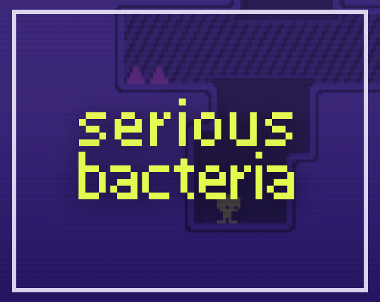
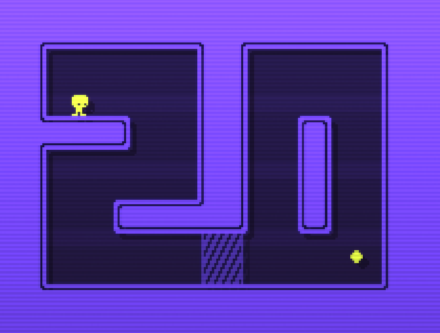
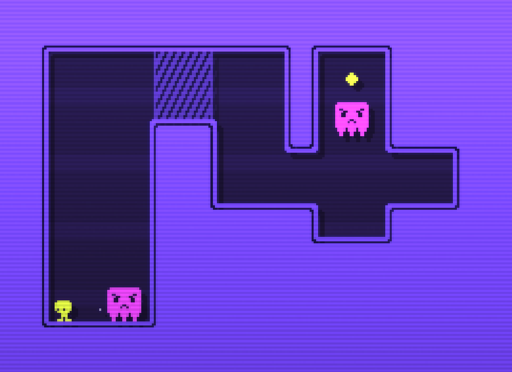
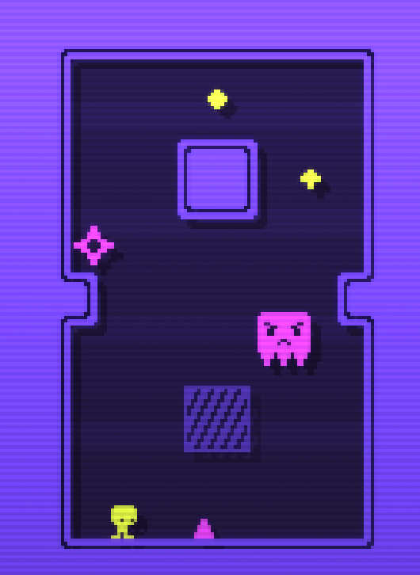

<!-- title: serious bacteria -->
<!-- tags: #gamejam -->

| | |
| --- | --- |
| 날짜 | 2026-07-25 |
| 제출 | [https://itch.io/jam/gmtk-jam-2026/rate/4814597](https://itch.io/jam/gmtk-jam-2026/rate/4814597) |
| 라이브러리 | love2d |

# 개요
주제는 **Countdown**이었다.

[giban](https://github.com/minufy/giban)을 개선한 [reban](https://github.com/minufy/reban)을 개선한 [rebased](https://github.com/minufy/rebased)를 기반으로 제작했다.

# 개발 과정
- 카운트다운 안에 미션 수행
- 숫자를 역으로 세기
- 개수 조절 (count를 down)
- 큰 숫자를 작은 숫자로 만들기
- count를 밑으로 내리기

같은 아이디어가 있었고, 처음에는 움직일때마다 count가 down되는 소코반 게임을 제작했다.

하지만 재미가 없어서 맵에 배치된 숫자들을 3, 2, 1 순서대로 먹는 플랫포머 게임으로 새로 시작했다.

개발하던 중 레벨 디자인을 숫자처럼 보이게 해서 카운트다운이 되게 하는 신박한 아이디어가 떠올라서 숫자를 먹는 컨셉을 버리고 새로 제작헀다.

*완성된 레벨의 모습*

# 결과
TBA